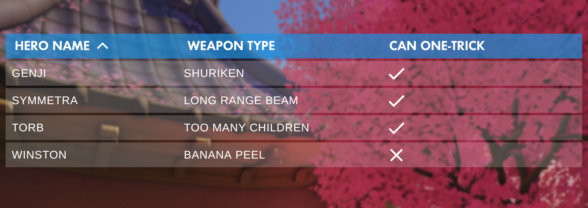

overwatch-table
=========

A React component modeling the Overwatch Custom Game table element

## Install

Note: Requires **React 16.2+**

	npm install --save overwatch-table

### Fonts

#### Futura No 2 D DemiBold

This font is used by Activision Blizzard for much of Overwatch's design. For this component **to match the Overwatch design, including the font is required**. It can be licensed from [MyFonts](http://www.myfonts.com/fonts/urw/futura-no-2/futura-no2-d-demi-bold/).

When using CSS font-face, the font-family should match whats below:

    font-family: 'Futura No 2 D DemiBold';

## Usage

Check out [example/index.js](example/index.js) for working example or below for exact usage.

    import Table from 'overwatch-table'

    const rows = [
        {
            name: 'Genji',
            weapon_type: 'Shuriken',
        },
        {
            name: 'Winston',
            weapon_type: 'Banana peel',
        },
        {
            name: 'Symmetra',
            weapon_type: 'Long-range beam'
        },
        {
            name: 'Torb',
            weapon_type: 'Too many children',
        },
    ]
    
    const columnLabels = {
        name: 'Hero Name',
        weapon_type: 'Weapon Type'
    }
    
    const columnOrder = [
        'name',
        'weapon_type',
    ]
    
    class Example extends React.Component {

        render() {    
            return <Table
                rows={rows}
                columnLabels={columnLabels}
                columnOrder={columnOrder}
            />
        }
    }

### Props

| name        | required | type           | default  | desc 
--- |--- | --- | --- | --- |
| columnLabels | **`X`** | object | null | Object of keys matching the keys of each item in `rows`, where the key's value is the label for that column in the Table. |
| columnOrder | **`X`** | array | null | Array of strings, matching the keys of each item in `rows`, in the desired order for the columns. |
| rows | **`X`** | array | null | Array of objects, with keys matching columnLabels and values that will be displayed in the Table cells. |

## Development

    npm run dev
  
#### Running the example

Install it:

    cd example/; npm install
    
Run it while developing (in another terminal window):

    cd example/; npm run dev
    
    
Open [http://localhost:8080/](http://localhost:8080/) to see the running example

## Tests

    npm test

### License

Made with 🍊 by [Chris Dolphin](https://github.com/likethemammal)

#### Fonts

The font **Futura No 2 D DemiBold** should be licensed through [MyFonts.com](http://www.myfonts.com/fonts/urw/futura-no-2/futura-no2-d-demi-bold/)
